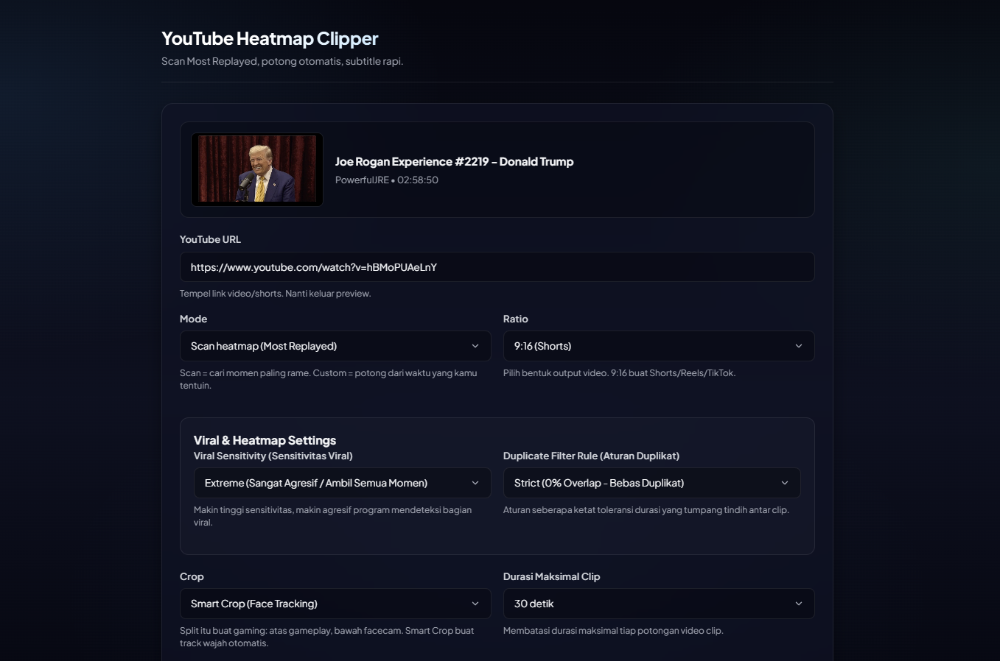
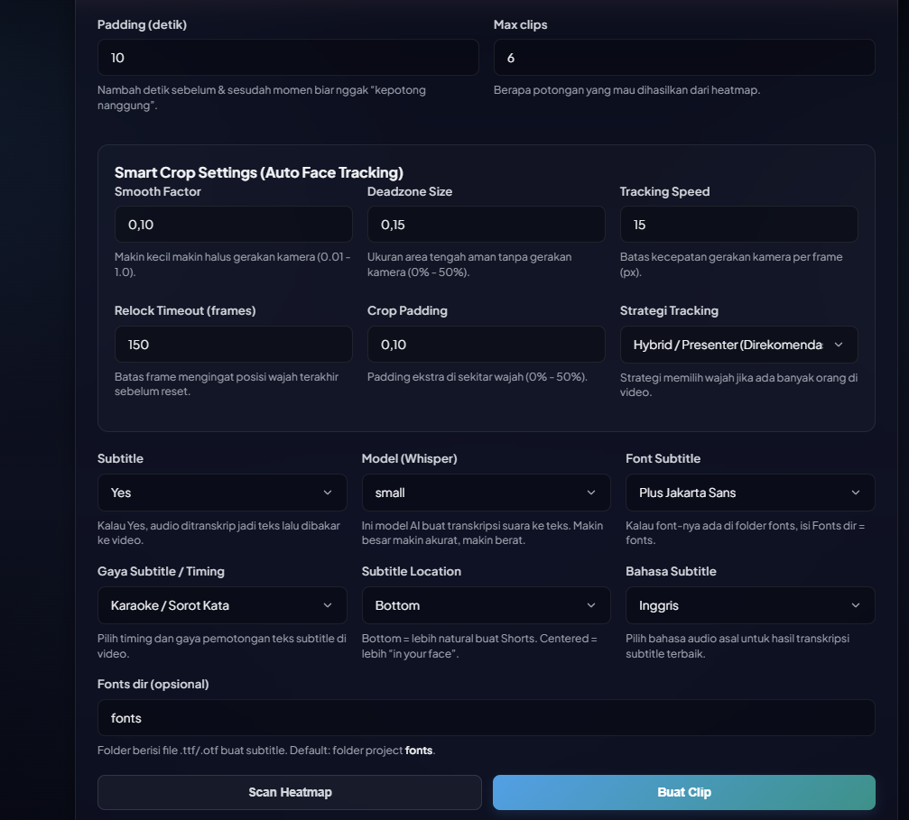
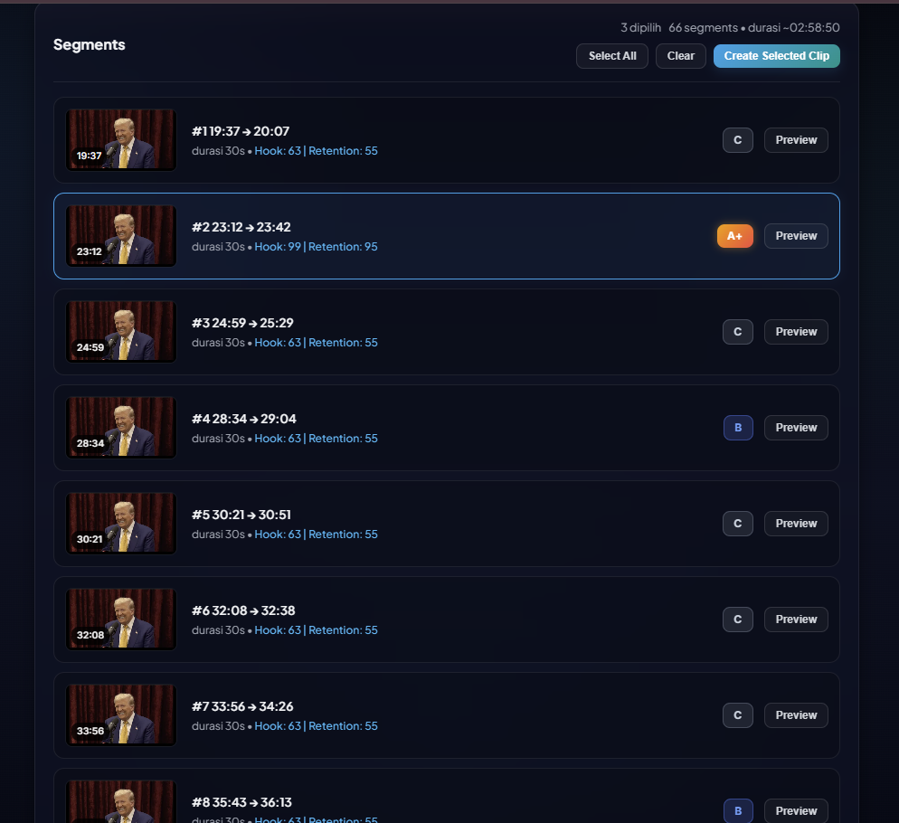
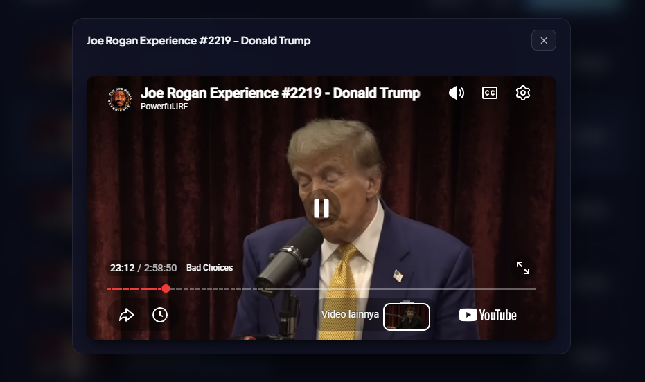
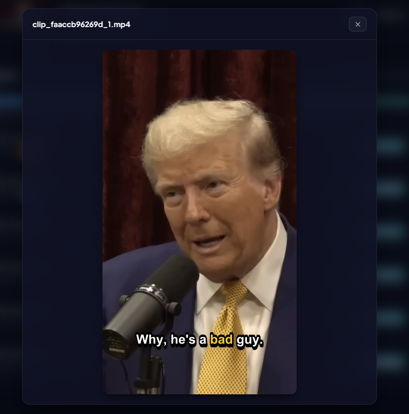
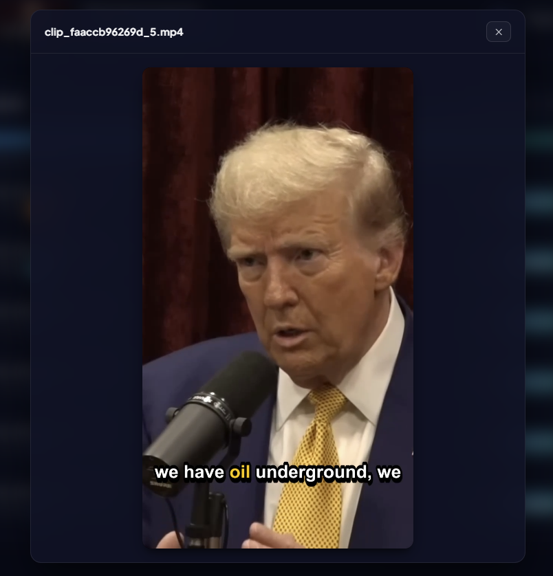

# YouTube Heatmap Clipper

[Bahasa Indonesia](README_ID.md) | [English](README.md)

A web application to extract the most engaging segments from YouTube videos using Most Replayed (heatmap) data, and automatically convert them into vertical-ready clips for Shorts, Reels, and TikTok, featuring AI-powered subtitles.

This project is a further development of the project: https://github.com/naufaljct48/youtube-heatmap-clipper which is based on the original project: https://github.com/0xACAB666/yt-heatmap-clipper. The development of this project focuses primarily on improving processing speed and refining the graphical user interface for ease of use.

## Preview

|                            |                            |
| -------------------------- | -------------------------- |
|  |  |
|  |  |
|  |  |

## New and Highlighted Features

This project has been updated with a focus on user experience, processing efficiency, and AI accuracy:

### 1. Smart Face Tracking with 99% Accuracy
*   **Hybrid Face Detection**: Uses the advanced YuNet DNN Face Detector Deep Learning model as the primary detector (automatically downloaded on first launch) and falls back to Haar Cascades (Frontal and Profile) if hardware-accelerated DNN is not supported.
*   **Scene Change Detection**: Intelligently detects camera cuts or transitions to instantly lock (auto-snap) onto the new face position without delay.
*   **Cinematic Smoothing and Deadzone**: Features a LERP smoothing algorithm for fluid camera panning and adjustable Deadzone configurations to filter out minor, jittery camera movements.

### 2. Advanced Heatmap Algorithm
*   **Viral Spike Detection**: The updated algorithm computes the mathematical derivative and local average of viewer retention to target actual engagement spikes, which represent the most viral moments.
*   **Smart Intro and Outro Filter**: Automatically filters out the first 10% (intro) and last 10% (outro) of the video to avoid clipping empty scenes or end screens.
*   **Viral Sensitivity and Overlap Filter**: Adjusts sensitivity levels (Low, Medium, High, Extreme) and overlap threshold configurations to obtain the best non-overlapping viral clip curations.

### 3. Faster with Multi-Worker Parallel Processing
*   **Parallel Processing Speedup**: Processes clips concurrently using a ThreadPoolExecutor with worker counts automatically and dynamically scaled based on system CPU threads.
*   **Fast-Seek Direct Stream Extraction**: Downloads segments rapidly via direct stream URL extraction with FFmpeg, or downloads the full video locally first for instant parallel slicing.

### 4. Focused on Web GUI for Ease of Use
*   **Refined Web UI**: Developed and enhanced the existing Flask-based interface to make it more responsive, intuitive, and easier to navigate without complex manual steps.
*   **Interactive Heatmap Scan**: Scans video URLs instantly to display all viral segments alongside interactive engagement graphs.
*   **Bulk Processing and Custom Ranges**: Allows selecting multiple segments to process and export them concurrently, or defining custom start and end timestamps manually.
*   **Real-time Logs and Built-in Player**: Monitors extraction progress in real-time through the log output panel, and allows playing or downloading completed clips directly from the browser.

### 5. Diverse Dynamic Subtitle Styles (Faster-Whisper)
*   **Faster Transcription**: Powered by Faster-Whisper, reducing transcription wait times to 4 or 5 times faster compared to the standard OpenAI Whisper implementation.
*   **5 Dynamic Subtitle Display Styles**:
    *   `sentence`: Displays the complete sentence normally.
    *   `word_by_word`: Displays text dynamically word-by-word.
    *   `phrase_by_phrase`: Displays short, easy-to-read phrases of up to 3 words.
    *   `line_by_line`: Displays line-by-line, automatically formatting longer text into up to 2 lines.
    *   `karaoke`: A dynamic karaoke effect that highlights the active word in yellow (#FFCC00).
*   **Custom Fonts and Placement**: Supports preferred fonts (Plus Jakarta Sans, Roboto, Montserrat, Arial, or Custom) and allows setting the location to either the middle (Centered) or the bottom (Bottom) of the frame.

---

## Requirements

### Supported Devices
*   This application **can only be run on desktop or laptop devices** (Windows, macOS, Linux) and **does not support mobile devices** (Android, iOS).

### Minimum Hardware Specifications
*   **Processor (CPU)**: Intel Core i3 / AMD Ryzen 3 or equivalent (minimum 4 cores recommended for good multi-worker performance).
*   **Memory (RAM)**: 4 GB minimum (8 GB or more recommended if using medium or large AI subtitle models).
*   **Storage**: 5 GB of free space minimum (to store temporary raw video files and AI transcription models).

### Software Requirements
- Python 3.8+ (Python 3.11 highly recommended)
- FFmpeg (Required and must be installed)
- Internet Connection
- Python Libraries (automatically installed by the launcher): flask, yt-dlp, opencv-python, faster-whisper (if subtitles are enabled), and related libraries.

## How to Use (Easiest Way)

Double-click the **web_start.bat** (or **start.bat**) file. The script will automatically:
1. Verify and install requirements in requirements.txt.
2. Create a secure Python Virtual Environment (venv).
3. Check for FFmpeg in the system path.
4. Launch the Flask web server.

## Installation and Running Manually

### 1. Install Requirements
```powershell
python -m pip install -r requirements.txt
python -m pip install faster-whisper
```
*Note: Skip faster-whisper if you do not require AI subtitle generation.*

### 2. Run the Web App
```powershell
python webapp.py
```
Open your browser and navigate to:
- http://127.0.0.1:5000/

---

## Using the Web GUI

1.  **Paste YouTube URL**: The video metadata (title, channel, thumbnail) will load automatically.
2.  **Select Clipping Mode**:
    *   **Scan Heatmap**: Click **Scan Heatmap** to auto-detect viral segments, check the boxes of the clips you want, and click **Create Selected Clips**.
    *   **Custom**: Enter manual **Start** and **End** times, and click the button to create manual ranges.
3.  **Configure Options**:
    *   **Ratio**: Select 9:16 (Vertical), 1:1 (Square), 16:9 (Horizontal), or Original ratio.
    *   **Crop Mode**: Select default (center crop), split (displays main video on top, facecam on the bottom-left or bottom-right), or smart (99% accurate face tracking crop).
    *   **Subtitle**: Turn on subtitles, choose language (ID/EN), choose Whisper model size, select font, style, and screen location.
    *   **Smart Crop Settings**: Fine-tune the smoothing factor, deadzone, tracking speed, and relock timeout parameters to optimize face tracking camera movements.
4.  **Export**: Track clipping progress in the console log at the bottom. Once complete, play or download your clips directly from the interface.

---

## Running via CLI (Optional)

If you prefer terminal commands, run:
```powershell
python run.py --url "https://www.youtube.com/watch?v=VIDEO_ID" --crop smart --subtitle y --whisper-model small --subtitle-font "Plus Jakarta Sans" --subtitle-location bottom --subtitle-style karaoke --ratio 9:16
```

### Key CLI Arguments:
*   `--crop`: default | split_left | split_right | smart (Face Tracking)
*   `--ratio`: 9:16 | 1:1 | 16:9 | original
*   `--subtitle`: y | n
*   `--subtitle-lang`: id | en (Default: en)
*   `--whisper-model`: tiny | base | small | medium | large-v3
*   `--subtitle-font`: Font name (e.g. Poppins)
*   `--subtitle-style`: sentence | word_by_word | phrase_by_phrase | line_by_line | karaoke
*   `--subtitle-location`: bottom | center
*   `--workers`: Number of parallel workers (0 for auto)

---

## Whisper Model Comparison

| Model        | Size   | RAM     | Speed (60s) | Accuracy  | Best For                |
| ------------ | ------ | ------- | ----------- | --------- | ----------------------- |
| **tiny**     | 75 MB  | ~500 MB | ~5-7s       | Good      | Quick clips, low-end PC |
| **base**     | 142 MB | ~700 MB | ~8-10s      | Better    | General purpose         |
| **small**    | 466 MB | ~1.5 GB | ~15-20s     | Great     | Quality content         |
| **medium**   | 1.5 GB | ~3 GB   | ~40-50s     | Excellent | Professional work       |
| **large-v3** | 2.9 GB | ~6 GB   | ~90-120s    | Best      | Production quality      |

> **Recommendation**: Use `tiny` for the fastest possible rendering speed, or `small` for a balance between transcription accuracy and processing overhead.

---

## Output Video Specifications

*   **Format**: MP4 (H.264 video + AAC audio)
*   **Supported Aspect Ratios**: 9:16 (720x1280), 1:1 (720x720), 16:9 (1280x720), or the original video's resolution and ratio.
*   **Video Codec**: Hardware Accelerated Encoder (e.g. h264_amf for AMD, h264_nvenc for NVIDIA, h264_qsv for Intel) if supported, with automatic fallback to libx264 (ultrafast preset, CRF 26).
*   **Audio Codec**: AAC, 128 kbps
*   **Subtitles**: Burned-in directly into the video file matching your font, style, and position preferences.

---

## FFmpeg Installation Guide

The application requires FFmpeg to function. On Windows, it attempts to auto-detect FFmpeg if installed via WinGet.

### Windows (Quickest Way):
Open PowerShell as Administrator and run:
```powershell
winget install Gyan.FFmpeg
```
After installation completes, restart your terminal or VS Code to apply PATH changes.

### macOS:
```bash
brew install ffmpeg
```

### Linux:
```bash
sudo apt update && sudo apt install ffmpeg
```

---

## License

This project is licensed under the MIT License.

## Credits and Special Thanks

- **Original Project**: Special thanks to the creator of the original project: https://github.com/0xACAB666/yt-heatmap-clipper
- **GUI Version & Initial Optimizations**: Special thanks to naufaljct48 who created the GUI version and initial optimizations: https://github.com/naufaljct48/youtube-heatmap-clipper
- [yt-dlp](https://github.com/yt-dlp/yt-dlp) - YouTube video downloader
- [FFmpeg](https://ffmpeg.org/) - Video processing suite
- [Faster-Whisper](https://github.com/guillaumekln/faster-whisper) - Fast AI speech-to-text library
- [OpenAI Whisper](https://github.com/openai/whisper) - Speech recognition model

---

## Support and Contribution

If you find this application helpful, please star the repository. Feel free to open a GitHub Issue for bugs, questions, or feature requests.
